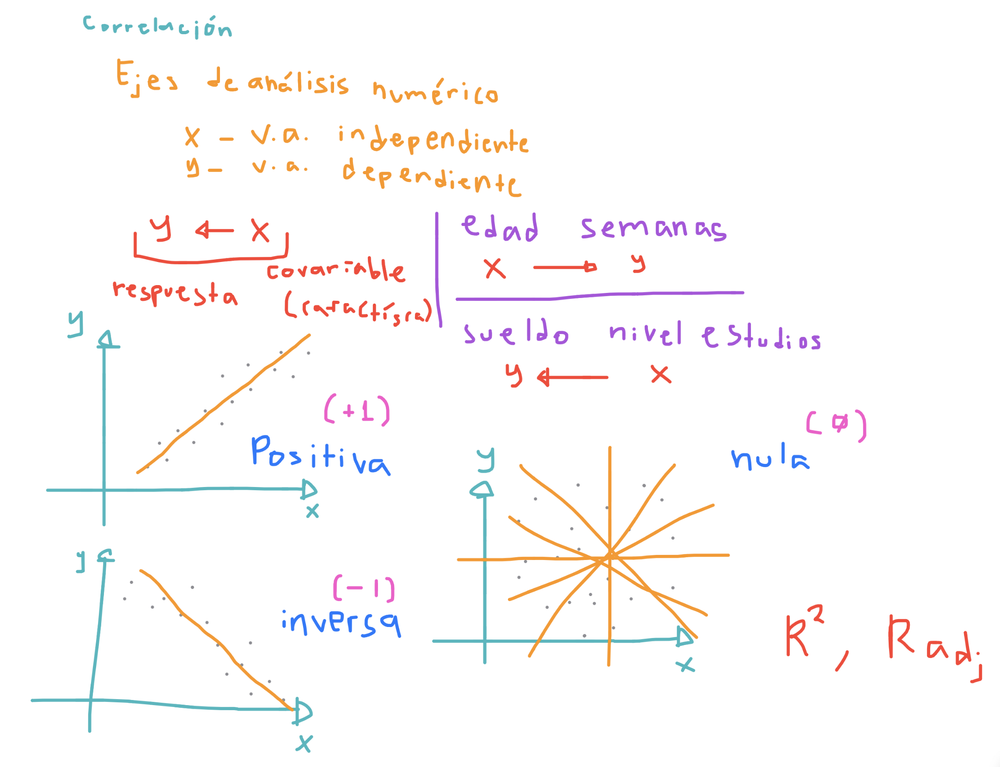
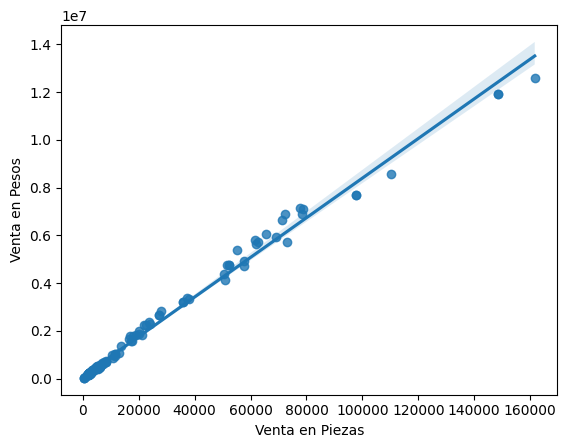
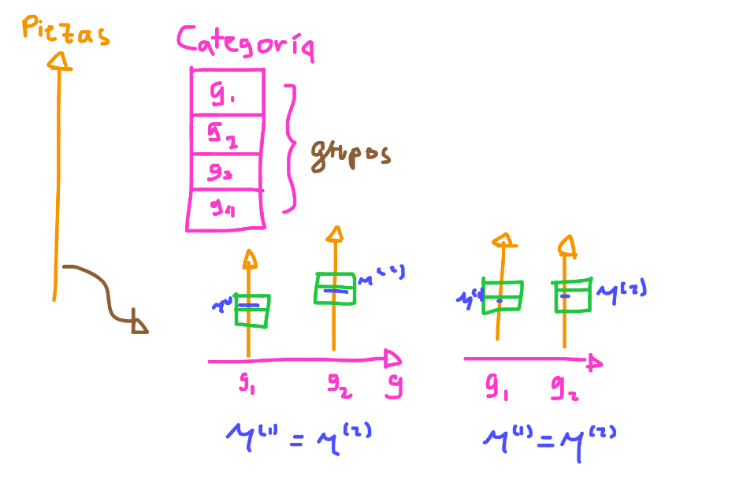
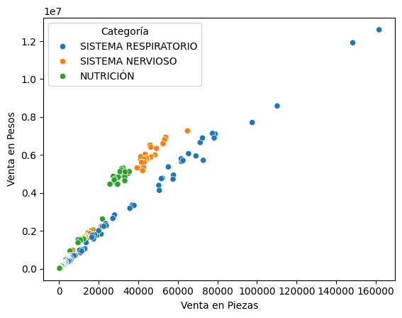

# Estadística diferencial y probabilidad

    Variables aleatorias
    Distribuciones
    Pruebas de hipótesis
    Correlación
    Regresión
    Análisis de la varianza (ANOVA)

## Variables aleatorias

Los fenémenos generalmente representan problemáticas o estudios de interés sobre comportamientos naturales o artificiales que quieren ser entendididos para su mejora y automatización. Estos se derivan en eventos que describen las causas involucradas y cada evento forma una población a la que llamaremos el universo de eventos o fenómeno.

Los eventos son carecterizados y descompuestos en características que se expresan como datos y conforman un conjunto de datos al que reconocemos como una muestra de la población, es decir, si la población es el universo de todos los eventos posibles asociados al fenómeno, entonces, una muestra de esa población será el conjunto de datos sobre las características del evento.

Cada característica representa un patrón natural del evento y su comportamiento no es constante sobre toda la población, al contrario de eso, mostrará un comportamiento variable y aleatorio, en el sentido que no se puede determinar el valor exacto de un siguiente registro en el conjunto de datos. Esta variabilidad es estudiada por la estadística mediante la construcción de **Variables Aleatorias**, y cuyo comportamiento aleatorio será estudiado por su probabilidad.

En resumen, tenemos que:

    Fenómeno 
        -se explica-> 
    eventos 
        -se caracterizan-> 
    características 
        -conforman-> 
    variables aleatorias 
        -generan-> 
    ejes de análisis

## Distribuciones

La probabilidad analiza eventos aleatorios que ocurren o pueden ocurrir como lanzar una moneda, lanzar los dados, si lloverá o el tiempo de llegada o espera. Estos eventos generalmente tienen naturalezas espacio-temporales y determinan posibilidades.

La posibilidad de que ocurra un evento se cuantifica como la probabilidad de que ocurra el evento según un conjunto de eventos observados. Por ejemplo, la probabilidad que al lanzar 2 dados salgan las caras $(1, 1)$ podría ser incierta, pero si observamos 36 posibles lanzamientos tendríamos:

$$
lanzamientos = \{ (1, 1), (1, 2), ..., (1, 6), (2, 1), (2, 2), ..., (2, 6), ..., (6, 6) \}
$$

El universo posible no significa que sea real ya que asumimos que cada evento tiene la misma posibilidad de ocurrir (por ejemplo, que los dados caen siempre equitativamente). Pero cuando observamos la realidad, podría ocurrir algo distinto, algunos eventos incluso podrían ni siquiera ocurrir en las $10,000$ observaciones que hicieramos.

A los eventos ocurridos les llamaremos probabilidades, a los eventos imaginados les llamaremos posibilidades.

La probabilidad consiste en observar eventos y cuantificar la frecuencia de apariciones u ocurrencias, a esta probabilidad para cada evento se le conoce como su densidad. Entonces, la densidad es una función que determina la probabilidad de que un evento ocurra según lo observado.

La densidad generalmente en fenómenos estables tiene un comportamiento fijo a lo largo de todos eventos y parecido a un montículo uniforme, normal, sesgado o bifurcado. En cualquier variante la densidad expresa un cúmulo de concentraciones de probabilidades a lo largo de ciertos valores. Cuando la probabilidad se convierte en una densidad y la densidad se aproxima a una función conocida matemáticamente se genera una función de densidad que describe la distribución de los datos.

La distribución de los datos le permite a la estadística plantear supuestos sobre los valores esperados y la dispersión entre los datos y cuantifica estos supuestos para construir estadísticos e intervalos de confianza que respaldan los supuestos de prónostico y predicción en los modelos de inferencia.

## Pruebas de hipótesis

La distribución normal explica todos los fenómenos o eventos poblacionales cuya tendencia es hacia un valor medio o promedio ($\mu$). Esta distribución visualmente parece tener una forma de campana y esta descrita mediante el valor de la desviación estándar de los datos (la raíz cuadrada de la varianza $\sigma^2$).

$$
f(x; \mu, \sigma^2) = \frac{1}{\sqrt{2 \pi \sigma^2}} \exp{- \frac{(\overline{x} - \mu)^2}{\sigma^2}} 
$$

La función de densidad permite describir el comportamiento de la variable aleatoria y hacer predicciones sobre su probabilidad, por ejemplo, se puede calcular el intervalo de probabilidad sobre que un dato se encuentre en una región (región de cobertura o probabilidad) y de que la media muestra se aproxime o capture en un intervalo de confianza a la media (intervalo de confianza).

El intervalo de confianza para una confianza $\alpha$ está dado por:

$$
IC_{\alpha}: (\overline{x} - Z_{\alpha / 2} \frac{\sigma}{\sqrt{n}} \le \mu \le \overline{x} + Z_{\alpha / 2} \frac{\sigma}{\sqrt{n}} )
$$

Con estos intervalos de confianza se puede construir un método estadístico para plantear una prueba donde la hipótesis sea que la media poblacional $\mu$ tomará el valor de una media específica $\mu_0$, es decir, queremos evaluar si la media de los datos adquiere algún valor y se describe mediante:

$$
H_0: \mu = \mu_0
$$

Alternativamente si la prueba es rechazada se supondrá que el supuesto no se cumple y se cumplirá la hipótesis alternativa:

$$
H_1: \mu \ne \mu_0
$$

Y a esta prueba se le conoce como **Prueba de Hipótesis** y tiene como ejemplo las siguientes aplicaciones:

1. La media de la edad de retiro en hombres es 62 años ($H_0: \mu = 62$)
2. La media del tiempo de espera del metrobus es de 3 minutos ($H_0: \mu = 3$)
3. La media de choques de autos los días lunes es a las 7 horas ($H_0: \mu_1 = 1, \mu_2 = 7$)

## Correlación

La correlación mide el grado de proximidad entre dos variables aleatorias que se asumen normales (se distribuyen normalmente) y tienen un efecto respecto a sus medias:

* **Positivo**: Ambas están arriba o debajo de sus medias
* **Inverso**: Una está arriba o debajo de su media mientras la otra está al revés
* **Nulo**: No hay un patrón claro en la diferencia de medias o las variables no son normales

La prueba pearson (Correlación de Pearson) permite obtener el grado de correlación entre dos variables aleatorias numéricas con los valores extremos:

* $+1$ - Si ambas variables crecen al mismo tiempo (correlación positiva)
* $-1$ - Si una variable crece mientras la otra decrece (correlación inversa)
* $0$ - Si la correlación es nula (se ve como una nube de puntos)

## Regresión

Cuando la correlación entre dos variables aleatorias es muy fuerte se determina que la linealidad en sus tendencias es muy fuerte, esto se interpreta como que una recta que expresa el comportamiento lineal entre la relación de ambas variables explica el patrón de comportamiento.

En términos simples, significa que una línea reacta muy poco aleaja (bandas cortas) de los datos es capaz de explicar el comportamiento entre la variable aleatoria independiente y la dependiente.

## Análisis de la varianza (ANOVA)

El método ANOVA (Analysis of Variance) es muy útil para probar estadísticamente en una prueba de hipótesis, si los datos de una variable aleatoria dividida en grupos mantendrá la misma media entre los grupos, es decir, que dividir los datos en grupos será insignificante o no informativo.

Sin embargo, cuando la prueba es rechazada, se justifica que al menos uno de los grupos tenga un comportamiento en su media y varianza distinto que el resto de grupos. Es por esto, que a esta prueba estadística se le conoce como el método de una vía entre-grupos.

La prueba de hipótesis se plantea como:

$$
H_0: \mu^{(1)} = \mu^{(2)} = \ldots = \mu^{(k)}
$$

donde $\mu^{(j)}, j = 1, 2, \ldots, k$ representa la media del j-ésimo grupo de la misma variable aleatoria.

Una forma ilustrada de ver este comportamiento es pensar que un eje de análisis (dado por la variable aleatoria de interés), es dividido en sub-ejes formados por un grupo cada uno. Es decir, un eje de análisis numérico como la cantidad de piezas vendidas es partido por otro eje de datos categórico como el tipo de venta.

En las pruebas de hipótesis el $p_{valor}$ determina la credibilidad (0 - baja, 1 - alta) de que la hipótesis $H_0$ sea aceptada.

Entre más bajo sea el $p_{valor}$, menos creible será que la hipótesis nula sea verdad, lo que significaría que al menos uno de los grupos tiene un comportamiento distinto.

Por ejemplo, las piezas vendidas de tipo `NUTRICIÓN` tienen un comportamiento similar a las piezas vendidas de tipo `SISTEMA NERVIOSO` (misma tendencia). Sin embargo, para piezas de tipo `SISTEMA RESPIRATORIO` el comportamiento es distinto, por lo que:

$$
H_0: \mu^{(1)} = \mu^{(2)} \ne \mu^{(3)}
$$

que explica que los primeros dos grupos se comportan de forma similar, pero estos se comportan distinto del tercer grupo.

Gráficamente lo vemos como que dos grupos tienen tendencias similares, pero el tercero no:

