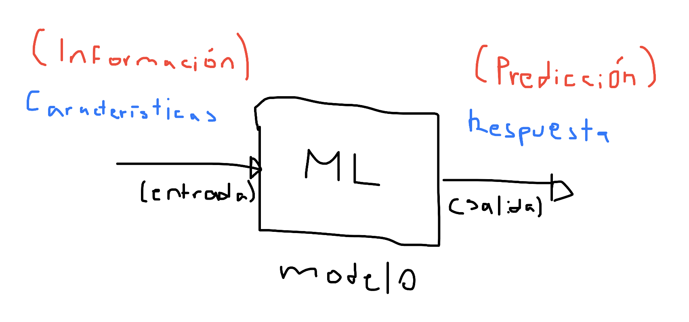
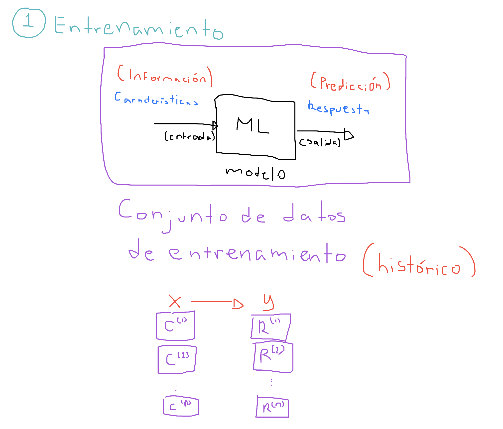
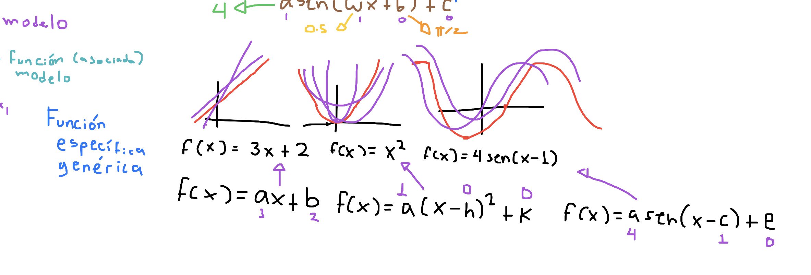
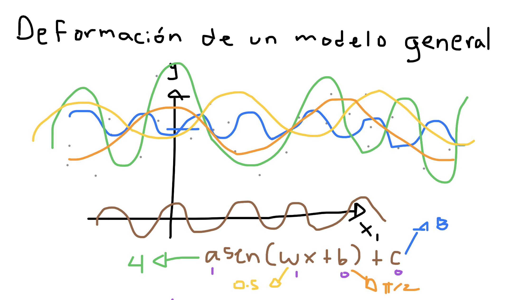
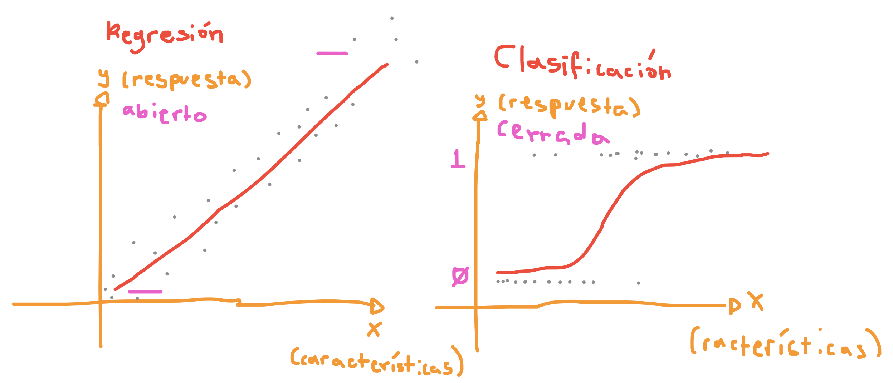
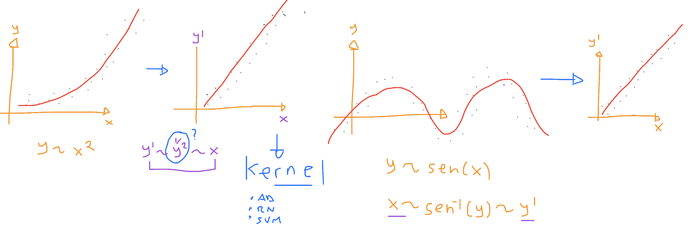

# Aprendizaje automático supervisado

    Flujo de un modelo de machine learning
    Regresión lineal y logística
    Árboles de decisión y Random Forest
    Métricas de evaluación: precisión, recall, F1-score

## Flujo de un modelo de machine learning

El *Machine Learning* (Aprendizaje Automático) consiste en construir un modelo que sea capaz de tomar decisiones automáticas, es decir, un modelo que dada una entrada produzca una salida que sea lo más cercana posible a la respuesta esperada y cuya entrada serán las características del problema.

### Fase 1 - Entrenamiento

Para que un modelo de aprendizaje automático pueda dar respuestas certeras necesita un conjunto de datos que incluya la asociación entre las características o información de la entrada y la respuesta o salida esperada. A este conjunto histórico le llamaremos el *Conjunto de Entrenamiento* y formaremos un problema concido como **El problema del aprendizaje supervisado** que consiste en recrear la realidad expresada por el conjunto de datos históricos para hacer predicciones en el mismo sentido, es decir, reflejar respuestas correctas basadas en el histórico de lo ocurrido.

A estos modelos de aprendizaje supervisado los llamaremos modelos de predicción o modelos de toma de decisiones automáticas, ya que en síntesis tomarán decisiones automáticas para las entradas o características presentes.

Cuando el modelo toma decisiones más allá de los datos observados (con características desconocidas), se conocerá como un modelo resiliente o extrapolado.

La fase de entrenamiento se divide en:

1. Adquisición o recopilación de los datos (adquisición)
2. Limpieza o imputación de los datos (limpieza)
3. Estructuración u organización de los datos (pre-procesamiento)

### Fase 2 - Ajuste del modelo

Un modelo general o genérico es una función de varias variables que tiene parámetros desconocidos que se pueden manipular para ajustarse a un conjunto de datos, por ejemplo, nuestros datos pueden representar puntos espacio y el modelo o la función genérica representan una superficie o variedad que se puede ir ajustando lo más próximo a los datos.

Cuando el modelo general logra ser ajustado lo más cerca de los datos generará un error de aproximación que entenderemos como el error de aprendizaje. Entre más flexible sea el modelo más parámetros tendrá y más difícil será ajustarlo, pero generará menos error. Entre menos parámetros el modelo será más rígido y fácil de ajustar, pero el error aumentará considerablemente. Por lo que el Machine Learning busca modelos generalizados que sean lo más flexibles y rígidos posibles. Cuando el modelo es muy flexible quedará pegado a los datos creando un sobreajuste y cuando el modelo es muy rígido quedará muy separado de algunos datos.

Entonces, el aprendizaje automático busca ajustar un modelo general que genere respuestas o predicciones automáticas a partir de la función genérica asociada y permita entender el comportamiento o patrón de los datos en una manera compleja según la geometría del modelo. Al modelo se le conoce como el patrón de los datos. Algunos modelos muy utilizados en el aprendizaje supervisado son:

1. Regresión lineal
2. Regresión logística
3. Árbol de decisión
4. Bosque Aleatorio
5. Redes neuronales

Según el tipo de respuesta usaremos un modelo u otro, ya que la diferencia está en el rango de predicción.

### Fase 3 - Validación del modelo

Una vez que el modelo ha sido ajustado a los datos de entrenamiento podemos validar qué tanta precisión tienen las predicciones generadas (respuestas automáticas) midiendo el error mediante una función de pérdida, la cual explicará qué tan ajustado está el modelo a los datos o qué tan lejano se encuentra de ellos.

Las principales métricas para funciones de pérdida son:

1. **Media de los Mínimos Cuadrados** - Determina la distancia geométrica entre la respuesta real y la respuesta de predicción y es utilizada por la regresión lineal y modelos abiertos como las redes neuronales de activación lineal o modelos de regresión
2. **Entropía cruzada** - Determina un factor de ponderación para cuando la respuesta es binaria o categórica (multi-binaria) y se utiliza por la regresión logística y modelos cerrados como las redes neuronales de activación sigmoide o modelos de clasificación

Cuando la respuesta esperada por el modelo de predicción es binaria o categórica se determina un **Problema de clasificación** y se suelen usar métricas especiales como:

* **Precisión**
* **Sensibilidad**
* **Especificidad**
* **F1-score**

Y la matriz de confunsión y la curva ROC/AUC.

## Regresión Lineal y logística

Existen dos problemas principales del aprendizaje automático y dos modelos clásicos que son potentes para determinarlos:

1. **Problema de regresión (lineal)** - Consiste en ajustar una nube de puntos (características más la respuesta *abierta*) a una recta, plano o híper-plano según el número de características.
2. **Problema de clasificación (logístico)** - Consiste en ajustar una nuebe puntos (caterísticas más la respuesta binaria *cerrada*) a una curva logística.

Ajuste del kernel para transformar una función no lineal en lineal.

### Regresión lineal

La regresión lineal consiste en encontrar un conjunto de parámetros **lineales** que ajusten una recta (plano o híperpláno) según el número de características (covariables). Los parémetros desconocidos se conocen como parámetros de regresión y expresan la importancia positiva o negativa de una covariable hacia la respuesta. Es decir, entre más grande sea un parámetro de regresión, mayor será la importancia de la covariable hacia la respuesta, a esta variable se le conocerá como variable informativa, y cuando el parámetro regresión es cero se le llama variable no informativa.

El modelo general está dado por:

$$
y = \beta_0 + \beta_1 x_1 + \beta_2 x_2 + \ldots + \beta_k x_k
$$

donde $x_1, x_2, \ldots, x_k$ son variables aleatorias independientes (covariables) que condifican las características del problema, y $\beta_0, \beta_1, \beta_2, \ldots, \beta_k$ son los coeficientes de regresión (los parámetros desconocidos o los parámetros asociados a la regresión).

Pero el modelo requiere aprender el comportamiento de la respuesta $y$ a partir de múltiples observaciones, es decir, la misma respuesta se debe ajustar a la observación 1:

$$
y = \beta_0 + \beta_1 x_1^{(1)} + \beta_2 x_2^{(1)} + \ldots + \beta_k x_k^{(1)}
$$
Los mismo que para la observación 2:

$$
y = \beta_0 + \beta_1 x_1^{(2)} + \beta_2 x_2^{(2)} + \ldots + \beta_k x_k^{(2)}
$$

y así para la n-ésima observación:

$$
y = \beta_0 + \beta_1 x_1^{(n)} + \beta_2 x_2^{(n)} + \ldots + \beta_k x_k^{(n)}
$$

es decir, que $k+1$ coeficientes de regresión deben ser aprendidos mediante $n$ observaciones.

### Regresión logística

El modelo general para regresión logística es similar a la regresión lineal, pero cerrando la respuesta al espacio binario mediante la función $\phi$ conocida como la función logística o sigmoide.

$$
y = \phi(\beta_0 + \beta_1 x_1 + \beta_2 x_2 + \ldots + \beta_k x_k)
$$

donde la función logística está determina por:

$$
\phi(z) = \frac{\exp{z}}{1 + \exp{z}}
$$

Por lo tanto la regresión logística se puede expresar como:

$$
y = \frac{\exp{\beta_0 + \beta_1 x_1 + \beta_2 x_2 + \ldots + \beta_k x_k}}{1 + \exp{\beta_0 + \beta_1 x_1 + \beta_2 x_2 + \ldots + \beta_k x_k}}
$$

