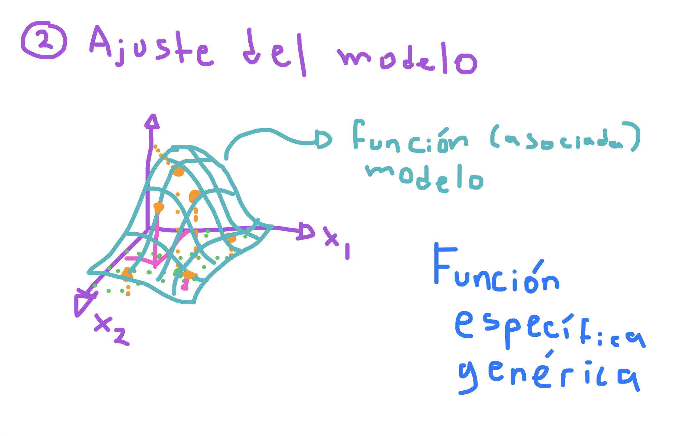
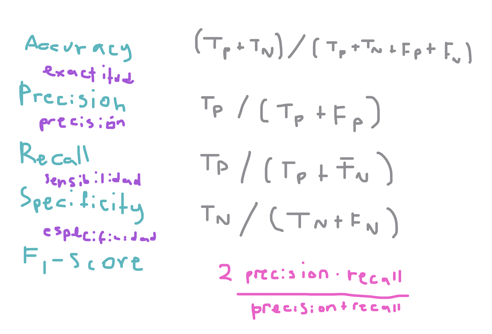

# Aprendizaje automático supervisado

    Flujo de un modelo de machine learning
    Regresión lineal y logística
    Árboles de decisión y Random Forest
    Métricas de evaluación: precisión, recall, F1-score

## Flujo de un modelo de machine learning

El *Machine Learning* (Aprendizaje Automático) consiste en construir un modelo que sea capaz de tomar decisiones automáticas, es decir, un modelo que dada una entrada produzca una salida que sea lo más cercana posible a la respuesta esperada y cuya entrada serán las características del problema.

### Fase 1 - Entrenamiento

Para que un modelo de aprendizaje automático pueda dar respuestas certeras necesita un conjunto de datos que incluya la asociación entre las características o información de la entrada y la respuesta o salida esperada. A este conjunto histórico le llamaremos el *Conjunto de Entrenamiento* y formaremos un problema concido como **El problema del aprendizaje supervisado** que consiste en recrear la realidad expresada por el conjunto de datos históricos para hacer predicciones en el mismo sentido, es decir, reflejar respuestas correctas basadas en el histórico de lo ocurrido.

A estos modelos de aprendizaje supervisado los llamaremos modelos de predicción o modelos de toma de decisiones automáticas, ya que en síntesis tomarán decisiones automáticas para las entradas o características presentes.

Cuando el modelo toma decisiones más allá de los datos observados (con características desconocidas), se conocerá como un modelo resiliente o extrapolado.

La fase de entrenamiento se divide en:

1. Adquisición o recopilación de los datos (adquisición)
2. Limpieza o imputación de los datos (limpieza)
3. Estructuración u organización de los datos (pre-procesamiento)

### Fase 2 - Ajuste del modelo

Un modelo general o genérico es una función de varias variables que tiene parámetros desconocidos que se pueden manipular para ajustarse a un conjunto de datos, por ejemplo, nuestros datos pueden representar puntos espacio y el modelo o la función genérica representan una superficie o variedad que se puede ir ajustando lo más próximo a los datos.

Cuando el modelo general logra ser ajustado lo más cerca de los datos generará un error de aproximación que entenderemos como el error de aprendizaje. Entre más flexible sea el modelo más parámetros tendrá y más difícil será ajustarlo, pero generará menos error. Entre menos parámetros el modelo será más rígido y fácil de ajustar, pero el error aumentará considerablemente. Por lo que el Machine Learning busca modelos generalizados que sean lo más flexibles y rígidos posibles. Cuando el modelo es muy flexible quedará pegado a los datos creando un sobreajuste y cuando el modelo es muy rígido quedará muy separado de algunos datos.

Entonces, el aprendizaje automático busca ajustar un modelo general que genere respuestas o predicciones automáticas a partir de la función genérica asociada y permita entender el comportamiento o patrón de los datos en una manera compleja según la geometría del modelo. Al modelo se le conoce como el patrón de los datos. Algunos modelos muy utilizados en el aprendizaje supervisado son:

1. Regresión lineal
2. Regresión logística
3. Árbol de decisión
4. Bosque Aleatorio
5. Redes neuronales

Según el tipo de respuesta usaremos un modelo u otro, ya que la diferencia está en el rango de predicción.

### Fase 3 - Validación del modelo

Una vez que el modelo ha sido ajustado a los datos de entrenamiento podemos validar qué tanta precisión tienen las predicciones generadas (respuestas automáticas) midiendo el error mediante una función de pérdida, la cual explicará qué tan ajustado está el modelo a los datos o qué tan lejano se encuentra de ellos.

Las principales métricas para funciones de pérdida son:

1. **Media de los Mínimos Cuadrados** - Determina la distancia geométrica entre la respuesta real y la respuesta de predicción y es utilizada por la regresión lineal y modelos abiertos como las redes neuronales de activación lineal o modelos de regresión
2. **Entropía cruzada** - Determina un factor de ponderación para cuando la respuesta es binaria o categórica (multi-binaria) y se utiliza por la regresión logística y modelos cerrados como las redes neuronales de activación sigmoide o modelos de clasificación

Cuando la respuesta esperada por el modelo de predicción es binaria o categórica se determina un **Problema de clasificación** y se suelen usar métricas especiales como:

* **Precisión**
* **Sensibilidad**
* **Especificidad**
* **F1-score**

Y la matriz de confunsión y la curva ROC/AUC.

## Regresión Lineal y logística

Existen dos problemas principales del aprendizaje automático y dos modelos clásicos que son potentes para determinarlos:

1. **Problema de regresión (lineal)** - Consiste en ajustar una nube de puntos (características más la respuesta *abierta*) a una recta, plano o híper-plano según el número de características.
2. **Problema de clasificación (logístico)** - Consiste en ajustar una nuebe puntos (caterísticas más la respuesta binaria *cerrada*) a una curva logística.

Ajuste del kernel para transformar una función no lineal en lineal.

### Regresión lineal

La regresión lineal consiste en encontrar un conjunto de parámetros **lineales** que ajusten una recta (plano o híperpláno) según el número de características (covariables). Los parémetros desconocidos se conocen como parámetros de regresión y expresan la importancia positiva o negativa de una covariable hacia la respuesta. Es decir, entre más grande sea un parámetro de regresión, mayor será la importancia de la covariable hacia la respuesta, a esta variable se le conocerá como variable informativa, y cuando el parámetro regresión es cero se le llama variable no informativa.

El modelo general está dado por:

$$
y = \beta_0 + \beta_1 x_1 + \beta_2 x_2 + \ldots + \beta_k x_k
$$

donde $x_1, x_2, \ldots, x_k$ son variables aleatorias independientes (covariables) que condifican las características del problema, y $\beta_0, \beta_1, \beta_2, \ldots, \beta_k$ son los coeficientes de regresión (los parámetros desconocidos o los parámetros asociados a la regresión).

Pero el modelo requiere aprender el comportamiento de la respuesta $y$ a partir de múltiples observaciones, es decir, la misma respuesta se debe ajustar a la observación 1:

$$
y = \beta_0 + \beta_1 x_1^{(1)} + \beta_2 x_2^{(1)} + \ldots + \beta_k x_k^{(1)}
$$
Los mismo que para la observación 2:

$$
y = \beta_0 + \beta_1 x_1^{(2)} + \beta_2 x_2^{(2)} + \ldots + \beta_k x_k^{(2)}
$$

y así para la n-ésima observación:

$$
y = \beta_0 + \beta_1 x_1^{(n)} + \beta_2 x_2^{(n)} + \ldots + \beta_k x_k^{(n)}
$$

es decir, que $k+1$ coeficientes de regresión deben ser aprendidos mediante $n$ observaciones.

### Regresión logística

El modelo general para regresión logística es similar a la regresión lineal, pero cerrando la respuesta al espacio binario mediante la función $\phi$ conocida como la función logística o sigmoide.

$$
y = \phi(\beta_0 + \beta_1 x_1 + \beta_2 x_2 + \ldots + \beta_k x_k)
$$

donde la función logística está determina por:

$$
\phi(z) = \frac{\exp{z}}{1 + \exp{z}}
$$

Por lo tanto la regresión logística se puede expresar como:

$$
y = \frac{\exp{\beta_0 + \beta_1 x_1 + \beta_2 x_2 + \ldots + \beta_k x_k}}{1 + \exp{\beta_0 + \beta_1 x_1 + \beta_2 x_2 + \ldots + \beta_k x_k}}
$$

## Problema de Clasificación

En los problemas de aprendizaje automático supervisado se descompone el conjunto de datos histórico (observaciones del fénomeno o problema) en dos tipos de variables aleatorias:

* **Características** - son las variables aleatorias independientes que **no aportan** una respuesta dependiente o directa, por ejemplo, las características de una persona para determinar su enfermedad, las características de un automóvil para determinar su eficiencia, las características económicas para deteminar una caída en la bolsa, etc.
* **Respuestas** - son las variables aleatorias dependientes de las características y que se derivan o predicen mediante un modelo dadas las otras variables, por ejemplo, si una persona tendrá diabetes dada su edad, presión arterial y peso, si un automóvil tendrá una falla mecánica los próximos 6 meses dadas sus características como presión de las llantas, número de puertas, marca del fabricante, tipo de conductor, si la bolsa tendrá un cierre positivo o negativo dadas las acciones e información del día, etc.

Cuando las respuestas del conjunto de datos son continuas (numéricas no acotadas), nos enfrentamos a un problema de regresión, donde el objetivo es buscar un valor entre casi infinitas posibilidades. Sin embargo, cuando la respuesta es categórica (un valor cualitativo o cuantitativo finito o acotado), entonces, nos enfrentamos a un problema de clasificación, donde cada categoría de la respuesta será tratada como una clase y el objetivo es encontrar la clase o categoría a las que pertenecen un conjunto de características, por ejemplo, dadas las características de una persona, responder el tipo de enfermedad que tiene, o dadas las características de un automóvil responder el tipo de falla mecánica en los próximos 6 meses o dadas las características de las acciones predecir el tipo de cierre en la bolsa.

Cuando la respuesta se simplifica a dos clases, entonces la consideramos una respuesta binaria y un problema de clasificación binario. Y cuando la respuesta tiene muchas clases se considera un problema de clasificación multi-clase.

En problemas binarios la regresión logística es suficiente, pero en problemas multi-clase los modelos de árboles de decisión y bosques aleatorios tienen mayor relevancia.

### Árbol de decisión

Una decisión ($h$) se compone de someter a una variable aleatoria de las características ($x_j$) para superar un umbral o número ($\eta_h$) que logre partir el espacio en dos ($x_j > \eta_h$). Entonces la respuesta que está formada de categorías o clases, determinará dos numéros de conteo sobre cuántas observaciones de las separadas quedan del mismo lado ($a_i$ - izquierda, $b_i$ - derecha), teniendo dos proporciones de cuántos datos hay de la misma clase en cada lado. Es decir, los valores $a_i$ y $b_i$ determinan las proporciones de aparaciones de la respuesta en la $i$-ésima clase antes y después del umbral.

Con los valores de las prorpociones $a_i$ y $b_i$ podemos calcular un índice de error llamado *gini* que se basa en el cálculo de la entroía entre ambos valores, ya que suponemos que los valores extremos son óptimos, es decir, que $a_i = 1$ cuando $b_i = 0$ o al revés $a_i = 0$ cuando $b_i = 1$. Esto es óptimo porque la clase estaría muy bien separada por el umbral. Pero si los valores no son extremos, entonces calculamos el error con la entropía como:

$$
\varepsilon_i = a_i b_i + (1 - a_i) (1 - b_i)
$$

Entonces, diremos que el umbral que separa mejor la decisión (separa bien las clases), es aquel que tenga una entropía o índice de *gini* casi cero, en promedio para todas las clases.

Por ejemplo, si la característica $x$ representa la distancia en kilómetros de un empleado a su trabajo y la respuesta es el tipo de demora que tendrá (clase 1 - $M$ madrugador, clase 2 - $P$ puntual y clase 3 - $L$ lento). Entonces podemos construir decisiones tomando la característica $x$ y fijando un umbral que separe las clases, por ejemplo, $15$ kilómetros y luego $6$ kilómetros. Para cada umbral hay que determinar su índice *gini* o entropía simple.

### Bosque aleatorio

Un árbol de decisión es capaz de tomar múltiples decisiones anidadas para llegar a una conclusión (probabilidad de que la respuesta sea cierta categoría o clase).

Sin embargo, muchos árboles de decisión podrían ser más precisos en la respuesta, por ejemplo, el primer árbol de decisión podría separar inmediatamente el espacio por la característica $x_{j_1}$, mientras que un segundo árbol de decisión podría separar inmediatamente el espacio por la característica $x_{j_2}$, creando decisiones distintas, que al final determinarán con mayor o menor precisión cuál es la clase final de respuesta.

Uniendo muchos árboles de decisión podemos crear un bosque aleatorio, que determine la respuesta promedio o respuesta más creíble de entre todos los árboles de decisión unidos. A este método de ensamble se le conoce como el **Bosque Aleatorio** (*Random Fores*) y consiste en crear un bosque con muchos árboles de decisión aleatorios que hagan más precisa la predicción de la respuesta.

### Métricas de evaluación

Al clasificar observaciones (respuestas categóricas), podemos centrarnos en qué tan bien el modelo o clasificador logra predecir si la clase o categoría es correcta (verdadero) o incorrecta (falsa).

Entonces, para cada observación podemos hacer conteo de cuántos resultados que debieron ser correctos fueron correctos (clasificados correctamente como verdaderos positivos) y cuántos resultados que debian ser incorrectos fueron incorrectos (clasificados correctamente como falsos positivos).

* **Verdadero positivo** - Cuando el valor observado o respuesta es la categoría y el modelo predice la misma la misma categoría se considera correcto en la forma verdadero positivo.
* **Falso positivo** - Cuando el valor observado o respuesta no es la categoría y el modelo predice otra categoría se considera correcto en la forma falso positivo.
* **Verdadero negativo** - Cuando el modelo predice la categoría pero el valor observado no es la categoría se considera incorrecto en la forma verdadero negativo (predicción a la categoría pero incorrecta).
* **Falso negativo** - Cuando el modelo predice otra categoría pero el valor observado es la categoría se considera incorrecto en la forma falso negativo (predicción a otra categoría incorrecta).

La matriz de confusión ordena los valores observados reales verderos (pertenece a la categoría) o falsos (no pertenece a la categoría) en un eje, y los valores de predicción verdaderos (se predice la categoría) o falsos (no se predice la categoría) en el otro eje, formando una matriz de conteos como:

$$
F_p F_p \\
T_n T_p
$$

Matriz de confusión

Métricas

